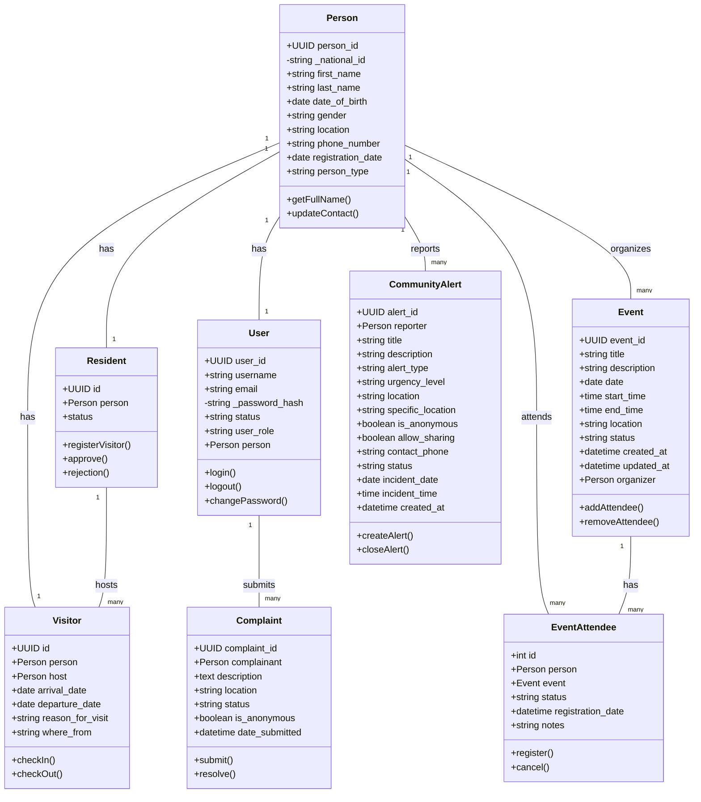

```mermaid

classDiagram
    %% ------------------------
    %% Main Models
    %% ------------------------
    class Person {
        +UUID person_id
        -string _national_id
        +string first_name
        +string last_name
        +date date_of_birth
        +string gender
        +string location
        +string phone_number
        +date registration_date
        +string person_type
        +getFullName()
        +updateContact()
    }

    class Resident {
        +UUID id
        +Person person
        +status
        +registerVisitor()
        +approve()
        +rejection()
    }

    class User {
        +UUID user_id
        +string username
        +string email
        -string _password_hash
        +string status
        +string user_role
        +Person person
        +login()
        +logout()
        +changePassword()
    }

    class Visitor {
        +UUID id
        +Person person
        +Person host
        +date arrival_date
        +date departure_date
        +string reason_for_visit
        +string where_from
        +checkIn()
        +checkOut()
    }

    class Event {
        +UUID event_id
        +string title
        +string description
        +date date
        +time start_time
        +time end_time
        +string location
        +string status
        +datetime created_at
        +datetime updated_at
        +Person organizer
        +addAttendee()
        +removeAttendee()
    }

    class EventAttendee {
        +int id
        +Person person
        +Event event
        +string status
        +datetime registration_date
        +string notes
        +register()
        +cancel()
    }

    class Complaint {
        +UUID complaint_id
        +Person complainant
        +text description
        +string location
        +string status
        +boolean is_anonymous
        +datetime date_submitted
        +submit()
        +resolve()
    }

    class CommunityAlert {
        +UUID alert_id
        +Person reporter
        +string title
        +string description
        +string alert_type
        +string urgency_level
        +string location
        +string specific_location
        +boolean is_anonymous
        +boolean allow_sharing
        +string contact_phone
        +string status
        +date incident_date
        +time incident_time
        +datetime created_at
        +createAlert()
        +closeAlert()
    }

    %% ------------------------
    %% Relationships
    %% ------------------------
    Person "1" -- "1" Resident : has
    Person "1" -- "1" User : has
    Person "1" -- "1" Visitor : has
    Person "1" -- "many" Event : organizes
    Person "1" -- "many" EventAttendee : attends
    User "1" -- "many" Complaint : submits
    Person "1" -- "many" CommunityAlert : reports
    Resident "1" -- "many" Visitor : hosts
    Event "1" -- "many" EventAttendee : has

```